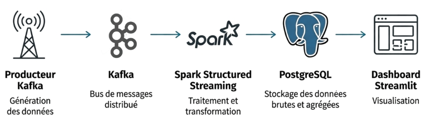

# RealTime Sensor Streaming Pipeline

Ce projet met en œuvre un pipeline de streaming de données de capteurs en temps réel en utilisant Docker Compose, Kafka, Spark Streaming, PostgreSQL et Streamlit.

## Architecture

1. **Producer (`producer.py`)**: Génère des données de capteurs factices (Température/Humidité) vers Kafka.
2. **Kafka/Zookeeper**: Couche de Message Broker pour l'ingestion des données.
3. **Spark Streaming (`spark_streaming.py`)**: Lit les messages de Kafka, effectue la transformation simple et écrit par lots dans PostgreSQL.
4. **PostgreSQL (`db`)**: Base de données de persistance pour les données traitées.
5. **Streamlit (`dashboard.py`)**: Tableau de bord de visualisation en temps réel, lisant les données de PostgreSQL.

## Prérequis

*   **Docker** et **Docker Compose** installés et en cours d'exécution.

## Instructions de Démarrage (Pour les Collaborateurs)

Clonez ce dépôt, naviguez jusqu'au dossier, puis suivez ces trois étapes dans des terminaux séparés si possible.

### 1. Démarrer l'Infrastructure (Kafka, DB, Spark, Apps)

Cette commande construit les images personnalisées et lance tous les services en arrière-plan.

`docker compose up --build -d`

### 2.Lancer le Job Spark Streaming
Ce job est lancé manuellement pour s'assurer que le cluster Spark est opérationnel.
NOTE : Le terminal restera bloqué par le job de streaming.
# 2a. Copier le script Spark (nécessaire pour l'image BDE)
`docker cp spark_streaming.py spark-master:/tmp/spark_streaming.py`

# 2b. Lancer le job Spark-Submit
`docker exec -it spark-master /spark/bin/spark-submit \
    --packages org.apache.spark:spark-sql-kafka-0-10_2.12:3.3.0,org.postgresql:postgresql:42.6.0 \
    --master spark://spark-master:7077 \
    /tmp/spark_streaming.py`
### 3.Accéder au Dashboard
Ouvrez votre navigateur :
`http://localhost:8501`
### Arrêt
Pour arrêter l'ensemble du pipeline et libérer les ressources : 
`docker compose down`

